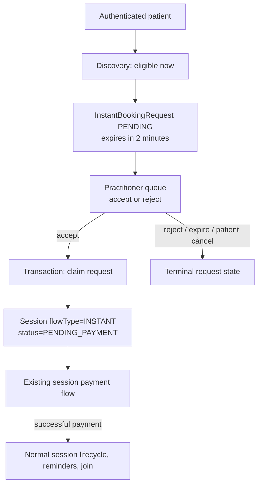

# Instant Booking — Current-State Discovery Audit

**Audit date:** 2026-08-08  
**Scope:** Read-only code and seed review of the Backend, Web, and Mobile repositories.  
**Change made by this audit:** This document only. No application code, schema, migration, seed, UI, configuration, or runtime data was changed.

## A. Purpose and decision

This audit establishes what the repository currently calls **Instant Booking**, rather than assuming it is a direct “book a practitioner who is available now” flow.

**Decision:** Instant Booking exists, but its implemented product meaning is **near-immediate practitioner-request and manual acceptance**, not direct instant booking. A patient selects an eligible practitioner and duration, creates a two-minute request, and waits for that practitioner to accept. Only after acceptance is a `Session` created, and that session then waits for payment.

It is therefore **not launch-ready for the intended direct-booking concept**. It can be described accurately as an on-demand request queue with immediate-availability validation.

## B. Implemented product meaning

| Candidate meaning | Current implementation | Evidence |
| --- | --- | --- |
| Direct instant booking | **No** | Patient `POST /patients/me/instant-booking-requests` creates only `InstantBookingRequest`; it does not create a session or payment. |
| Near-immediate booking | **Partially** | Start is calculated as the current UTC instant and the practitioner must be currently online and available. |
| Practitioner-request flow | **Yes** | Practitioner has explicit `POST :id/accept` and `POST :id/reject` endpoints and queue screens. |
| Patient sends request then practitioner accepts | **Yes** | `AcceptInstantBookingRequestUseCase` claims the pending request, creates the linked `Session`, and notifies the patient. |

The API, repositories, mapper, status model, request-expiry worker, Web screens, and Mobile screens all reinforce this request/accept behavior. The source comment in `CreateInstantBookingRequestUseCase` explicitly calls creation a “request-layer operation only.”

## C. Entry points and route inventory

### Backend

| Actor | Endpoint | Actual result |
| --- | --- | --- |
| Patient | `GET /api/v1/patients/me/instant-booking/practitioners` | Lists currently eligible candidates, paginated after in-memory eligibility evaluation. |
| Patient | `POST /api/v1/patients/me/instant-booking-requests` | Creates a two-minute `PENDING` request. |
| Patient | `GET /api/v1/patients/me/instant-booking-requests` / `:id` | Lists or retrieves the patient-owned request. |
| Patient | `POST /api/v1/patients/me/instant-booking-requests/:id/cancel` | Cancels a pending patient-owned request. |
| Practitioner | `GET /api/v1/practitioners/me/instant-booking-requests/pending` | Lists active pending requests. |
| Practitioner | `GET /api/v1/practitioners/me/instant-booking-requests` | Lists all requests assigned to the practitioner. |
| Practitioner | `POST /api/v1/practitioners/me/instant-booking-requests/:id/accept` | Atomically claims the request, creates a `PENDING_PAYMENT` instant `Session`, and links it. |
| Practitioner | `POST /api/v1/practitioners/me/instant-booking-requests/:id/reject` | Rejects a pending request. |
| Practitioner | `PUT /api/v1/practitioners/me/presence/instant-booking` | Enables/disables instant-request readiness, independent of generic presence. |

All routes require JWT and role/account-state guards. Patient routes require an active patient; practitioner routes additionally require approved and OTP-verified practitioner access.

### Web

- Patient page: `/[locale]/patient/instant-booking` via `src/app/[locale]/(patient)/patient/instant-booking/page.tsx` and `PatientInstantBookingScreen`.
- Practitioner queue: `/[locale]/practitioner/instant-booking` via `src/app/[locale]/(practitioner)/practitioner/instant-booking/page.tsx` and `PractitionerInstantBookingRequestsScreen`.
- Practitioner sessions also embed `PractitionerPendingRequestsPanel`.
- The practitioner availability screen exposes only the normal-bookings intake switch. It reads `isInstantBookingEnabled` in the booking-settings response but does **not** render or mutate the instant-booking presence toggle.

### Mobile

- Patient route: `app/(patient)/instant-booking.tsx`.
- Practitioner route: `app/(practitioner)/instant-booking.tsx`.
- Practitioner availability route: `app/(practitioner)/availability/index.tsx`; it renders and mutates the instant-booking toggle through `PUT /practitioners/me/presence/instant-booking`.

## D. Architecture map

Important boundaries:

- `InstantBookingRequest` is a request/audit record, not the booking source of truth.
- `Session` becomes the source of truth only after practitioner acceptance.
- No payment is created or authorized during request creation or acceptance.
- Standard session reminder, join, cancellation, financial, and ledger systems apply only once a normal `Session` reaches the relevant lifecycle state.

## E. Patient flow

1. The patient opens the discovery screen. The Web and Mobile clients call the protected discovery endpoint through their authenticated API clients.
2. The backend lists candidates that are approved, public, priced, instant enabled, have an active specialty, and then filters for live online presence, a published availability window containing “now”, exceptions, and blocking sessions.
3. The patient selects a 30- or 60-minute video/audio consultation. The create DTO has no selected slot, payment method, package, coupon, idempotency key, or currency field.
4. `CreateInstantBookingRequestUseCase` validates the target again, snapshots all four practitioner instant prices into request metadata, and writes a `PENDING` request with `expiresAt = now + 2 minutes`.
5. The patient UI polls the current request every three seconds while it is pending and may cancel it. It shows a payment action only after the practitioner has accepted and a `createdSessionId` exists.
6. After acceptance, the payment action navigates to the existing session-payment route. The instant request itself does not contain a checkout URL or payment confirmation.

### Patient ownership and safety

- The patient lookup is by authenticated user profile.
- Get/list/cancel use the authenticated patient profile; a request owned by another patient is not exposed.
- Creation first expires stale requests and checks a same-patient/same-practitioner active duplicate, but this is an application-level read-before-write check—not a partial unique database constraint or idempotency key.

## F. Practitioner flow and activation

### Toggle and readiness

The authoritative runtime toggle is `PractitionerPresence.isInstantBookingEnabled`, not `PractitionerProfile.isInstantBookingEnabled`. The profile field exists too, but discovery and eligibility read the presence record.

`PUT /practitioners/me/presence/instant-booking` validates that all four prices are non-null/non-empty before enabling:

- 30 EGP
- 30 USD
- 60 EGP
- 60 USD

It does **not** itself require ONLINE status or a current published availability window. Those are required later at discovery, request creation, and acceptance.

### Acceptance

- The practitioner queue uses explicit Accept/Reject controls; a request is not auto-accepted.
- Acceptance revalidates live eligibility, recomputes `startsAtUtc = now`, and calculates `endsAtUtc` from the requested duration.
- Inside a transaction, `updateMany` changes only an unexpired, unlinked `PENDING` row to `ACCEPTED`; exactly one concurrent accept can claim it.
- It creates a `Session` with `flowType=INSTANT`, `status=PENDING_PAYMENT`, `paymentCoverageType=DIRECT_PAYMENT`, no package purchase, and a 15-minute payment reservation.
- The session is linked back to `InstantBookingRequest.linkedSessionId`, which is unique.

## G. Availability, timezone, and immediate time semantics

The system uses a practitioner's resolved timezone to find current/next published availability weeks and expands them to UTC windows. It checks:

- approved/public/profile-complete practitioner visibility;
- active user account;
- active specialty;
- presence effectively ONLINE (not BUSY, AWAY, stale, or OFFLINE);
- `PractitionerPresence.isInstantBookingEnabled`;
- video or audio mode only;
- normal session-duration validation;
- published availability covering `[now, now + duration)`;
- active availability exceptions;
- existing blocking sessions; and
- session conflict validation.

The immediate start is not a configurable buffer or a slot selected by the patient: it is `nowUtc` at validation. Acceptance recalculates it; a session may therefore start later than the original patient request due to practitioner response time.

**Observed limitations:**

- Discovery uses a 24-hour lookahead to identify a window that has already started, then derives support for 30/60 minutes; creation and acceptance are the authoritative rechecks.
- Discovery computes pagination after loading and filtering candidates in process. This is functionally correct for its result set but does not scale as a database-filtered availability query.
- The request does not persist a selected availability window or a promised start time, so there is no reservation between discovery/request and acceptance.

## H. Pricing, payment, currency, and finance

### Current behavior

- Practitioner data has independent decimal instant prices for 30/60 and EGP/USD.
- Request creation snapshots those four price strings under `metadataJson.pricingSnapshot`.
- The financial-rules service recognizes `SessionFlowType.INSTANT`, maps it to `PaymentPurpose.SESSION_INSTANT_BOOKING`, and prefers the frozen request snapshot for the currency chosen by the existing payment-region logic.
- On acceptance, the new session is direct-payment only and has no package linkage.
- No payment is created, authorized, captured, or refunded when a request is created, rejected, cancelled, or expires.

### Currency finding

Discovery receives a `currency` query parameter in its DTO, but the use case resolves the currency from request-country regional policy and passes that resolved currency into the candidate repository. The Web client does not send currency; Mobile sends it, but the backend’s actual filter/response is still regional-policy-owned. This avoids client-controlled price currency, but the public DTO/client contract is misleading.

### Financial correctness finding

The price snapshot is protected from later price edits, which is good. However, it contains both currencies and the request does not record the final selected payment currency. The final currency is determined when payment pricing is resolved. For an on-demand request flow this may be acceptable; for a direct-booking quote it is insufficiently explicit and should be a deliberate product decision.

## I. Double booking, idempotency, and concurrency

### What is protected

- The accept claim is atomic for the individual request.
- `InstantBookingRequest.linkedSessionId` is unique, preventing one request from linking multiple sessions.
- PostgreSQL has partial GiST exclusion constraints on `Session` for patient and practitioner overlapping `[scheduledStartAt, scheduledEndAt)` ranges while the status is payment-pending or active. A concurrent conflicting session insert should fail at database level, and the accept use case maps the overlap conflict to a client conflict.
- Session overlap validation is performed before the accept transaction as an earlier user-facing check.

### What is not protected or is only partially protected

- Creation's duplicate check is read-then-write and has no database partial unique constraint. Concurrent requests from the same patient to the same practitioner can race into multiple pending rows.
- The duplicate check includes both patient and practitioner, so it does not limit multiple different patients from creating pending requests for the same practitioner. This is expected for a request queue, but it confirms that no practitioner-time reservation exists before acceptance.
- There is no idempotency key on the patient create endpoint.
- The availability/conflict recheck happens before the accept transaction. The PostgreSQL session exclusion constraint is the final protection once inserting the `Session`; the request claim then rolls back with the transaction if creation conflicts.

**Conclusion:** the final actual session is protected against overlapping session rows, but “available now” is not reserved during the two-minute request window. This is consistent with a manual acceptance queue, not a direct booking commitment.

## J. Notifications, reminders, sessions, and join

### Request notifications

`OperationalNotificationService` sends patient-facing in-app/email/push-template notifications for:

- accepted;
- rejected; and
- expired requests.

They target the patient instant-booking route and reference the request ID. There is no observed request-created notification to the practitioner in this module; practitioners obtain requests by polling their queue.

### Session notifications and join

The instant module does not create reminder jobs, a provider room, or join credentials itself. Once payment succeeds, the created session follows the existing session lifecycle. The centralized session schedule policy and join-bootstrap architecture are therefore downstream of the instant request/accept/payment chain.

There is no immediate “join now” path at request creation or practitioner acceptance. A patient must first pay, and the normal session status/schedule policy must make the session joinable.

## K. Web and Mobile UX state

### Implemented

- Both clients have patient discovery cards, 30/60 duration choices, status/polling states, cancellation, and payment navigation after acceptance.
- Both clients have practitioner queues with countdowns and accept/reject actions.
- Both use authenticated API clients.
- Mobile has a presence/instant-booking switch on practitioner availability.
- Web embeds the queue in the practitioner sessions experience and provides a dedicated queue page.

### Gaps and inconsistencies

- Web has no UI to enable/disable `PractitionerPresence.isInstantBookingEnabled`; its booking intake panel only manages normal bookings.
- The Mobile practitioner-home card says that patient appointments are “confirmed instantly” / “تأكيد ... فوراً” when enabled. This contradicts the explicit manual accept flow.
- The Web/Mobile UX shows “available now”, but the completed action is “send a request” and may expire in two minutes. The product language needs to make that wait/approval explicit if the current design is retained.
- There is no evidence in the inspected source of end-to-end tests for browser/mobile navigation from request acceptance through payment and then join.

## L. Packages, cancellation, rescheduling, and replacement

### Packages

Instant sessions are created with direct payment and no `packagePurchaseId`; the request API does not accept package data. Instant booking cannot presently consume package entitlements. Package price/entitlement logic is not invoked by the instant module.

### Cancellation

- A `PENDING` request can be cancelled by its patient before finalization; no money has moved.
- A created instant session uses `SessionFlowType.INSTANT`; the existing cancellation-policy service selects `SessionCancellationBookingType.INSTANT` for it.
- Refund behavior is therefore determined only after a payment exists and via standard session cancellation/refund services.

### Reschedule/replacement

No instant-booking-specific reschedule or replacement behavior was found. After acceptance, the entity is an ordinary `Session` and uses the normal session lifecycle. The request remains the origin/audit link, not a new booking engine.

## M. Security and privacy review

Positive controls observed:

- JWT, role, and account-state guards on every patient/practitioner endpoint.
- Patient ownership checks for reading/cancelling requests.
- Practitioner ownership checks for listing and acting on requests.
- Request-to-session linkage is unique and acceptance is atomically claimed.
- The request response does not expose payment secrets, provider room URLs, or join credentials.

Risks/areas to address before a direct-booking launch:

- No idempotency protection for patient request creation.
- No persistent availability hold before acceptance/payment.
- No direct-booking-specific fraud/rate-limit/abuse policy was found in this module beyond general API protections.
- Price/currency selection is not explicitly committed at request time.
- No observed practitioner creation notification means operational responsiveness relies on client polling.

## N. Development seed and deterministic verification support

`prisma/seed/modules/curated-dev.seed.ts` contains seeded practitioners with instant prices and profile flags. In particular:

- `dr-mohamed-mahmoud` has all four prices, an approved/public profile, and a presence row seeded `ONLINE` with instant booking enabled.
- `dr-youssef-abdallah` is instant enabled in presence but seeded `AWAY` with old timestamps, so should not appear as currently available.
- `dr-hassan-tarek` has profile-level instant enabled/prices but no corresponding presence seed in the inspected section; profile-level state alone is insufficient for discovery.

The seed creates live presence timestamps relative to seed execution, so liveness naturally expires. The availability-week seed is dynamic by current week, but no deterministic instant-booking request/session fixture, request-idempotency scenario, or dedicated `seed:instant-booking` workflow was found. Consequently, a fresh seed does not guarantee a named, currently eligible, end-to-end instant-booking scenario at arbitrary verification time.

## O. Existing test coverage and gaps

Focused unit tests exist for:

- request creation;
- request expiration;
- practitioner discovery;
- practitioner request listing;
- accept/reject state transitions;
- request expiry sweeper;
- eligibility validation;
- session creation from accepted request; and
- financial quote snapshot use for instant sessions.

Not established by the inspected test set:

- concurrent create requests and duplicate prevention at database level;
- concurrent acceptance plus PostgreSQL overlap-constraint proof;
- payment success/expiry/cancellation from an instant-origin session;
- direct/package entitlement behavior (the current flow has no package support);
- Web and Mobile end-to-end behavior;
- Mobile copy matching backend semantics;
- deterministic full-stack seed scenario; and
- joined-session/reminder lifecycle after instant payment.

## P. Major blockers before launch

1. **Product semantics mismatch (critical):** the feature is called “Instant Booking” but is architected and implemented as a practitioner approval queue.
2. **No reservation/checkout commitment (critical for direct booking):** availability can disappear while the request waits; payment starts only after manual acceptance.
3. **Duplicate request race (high):** no create idempotency key or database partial unique protection for active same-patient/same-practitioner requests.
4. **Web activation gap (high operational):** practitioners cannot turn the authoritative instant presence switch on/off from Web.
5. **Mobile copy contradicts behavior (medium):** it promises automatic confirmation although acceptance is manual.
6. **Seed/runtime proof gap (medium):** no deterministic active instant scenario for repeatable development verification.
7. **Currency contract ambiguity (medium):** client `currency` input exists but regional policy owns the actual currency, and the request does not record a selected payment currency.

## Q. Recommended smallest safe implementation plan

This is a recommendation only; no change was made by this audit.

1. Make a product decision: retain and rename/reword this as “Request an immediate session,” or implement a genuinely direct booking flow. Do not keep contradictory UX.
2. If retaining manual approval, add a Web control for the existing presence toggle, correct Mobile copy, send a practitioner request-created notification, and add create idempotency/duplicate protection.
3. If implementing direct booking, introduce an explicit availability hold/quote/payment sequence with an authoritative start/end and selected currency, while retaining the existing PostgreSQL overlap constraints as final enforcement.
4. Add deterministic development fixtures and integration tests covering request expiry, acceptance conflict, payment, cancellation, and both client paths.

## Files inspected

### Backend

- `sawiyaa-backend-v1/prisma/schema.prisma`
- `sawiyaa-backend-v1/prisma/migrations/20260618160000_phase2d_session_overlap_exclusions/migration.sql`
- `sawiyaa-backend-v1/prisma/migrations/20260715130000_canonical_session_lifecycle/migration.sql`
- `sawiyaa-backend-v1/src/modules/instant-booking/**`
- `sawiyaa-backend-v1/src/modules/presence/controllers/practitioner-presence.controller.ts`
- `sawiyaa-backend-v1/src/modules/presence/use-cases/set-my-instant-booking-availability.use-case.ts`
- `sawiyaa-backend-v1/src/modules/notifications/services/operational-notification.service.ts`
- `sawiyaa-backend-v1/src/modules/sessions/repositories/session.repository.ts`
- `sawiyaa-backend-v1/src/modules/sessions/services/validate-session-conflicts.service.ts`
- `sawiyaa-backend-v1/src/modules/sessions/services/evaluate-session-cancellation-policy.service.ts`
- `sawiyaa-backend-v1/src/modules/payments/services/resolve-session-payment-pricing.service.ts`
- `sawiyaa-backend-v1/src/modules/financial-rules/services/calculate-session-financial-breakdown.service.ts`
- `sawiyaa-backend-v1/prisma/seed/modules/curated-dev.seed.ts`
- `sawiyaa-backend-v1/prisma/seed/modules/availability-weeks.seed.ts`

### Web

- `sawiyaa-frontend-v1/src/app/[locale]/(patient)/patient/instant-booking/page.tsx`
- `sawiyaa-frontend-v1/src/app/[locale]/(practitioner)/practitioner/instant-booking/page.tsx`
- `sawiyaa-frontend-v1/src/features/instant-booking/**`
- `sawiyaa-frontend-v1/src/features/booking-settings/**`

### Mobile

- `sawiyaa-mobile/app/(patient)/instant-booking.tsx`
- `sawiyaa-mobile/app/(practitioner)/instant-booking.tsx`
- `sawiyaa-mobile/app/(practitioner)/availability/index.tsx`
- `sawiyaa-mobile/app/(practitioner)/index.tsx`
- `sawiyaa-mobile/src/features/instant-booking/**`
- `sawiyaa-mobile/src/features/practitioner/presence/api.ts`

