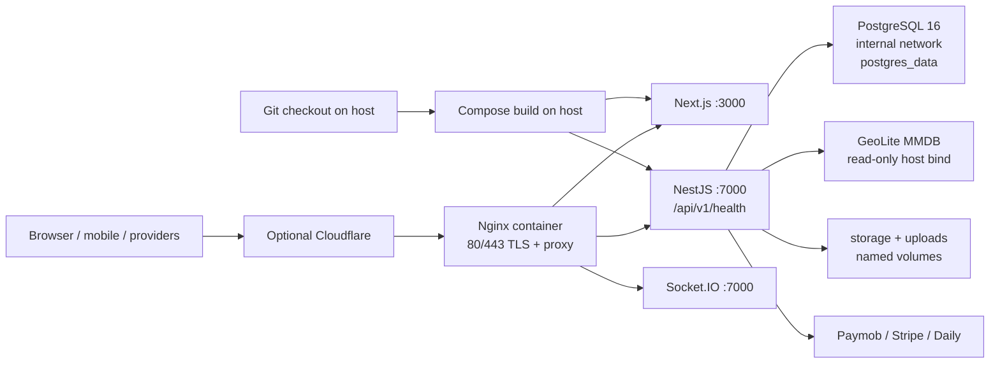

# Sawiyaa DevOps Audit and Roadmap

Audit date: 2026-08-01. Repository: `D:\Web\full-projects\sawiyaa`. Scope: read-only architecture/readiness analysis. No production connection, branch, commit, push, migration execution, destructive database command, or source implementation was performed.

## 1. Executive summary

Sawiyaa is a single-host Docker Compose platform containing NestJS, Next.js, PostgreSQL 16, and Nginx. PostgreSQL is internal and persistent; Nginx publishes 80/443; backend/frontend are currently built from the server checkout (`docker-compose.prod.yml:2-145`). The repository has good foundations—Zod environment validation, Prisma migrations, container health checks, a checksum-producing backup script, manual production dispatch, and workflow concurrency—but is not ready for automated production delivery.

The highest risks are: a heavily dirty working tree on `fix/production-deployment-parity`; source reset and mutable local builds on the server; migrations run without a backup step; destructive/financial migration history; no immutable image/digest/release manifest; split environment contracts; and a currently failing frontend lint gate. Recommended target: retain Compose and the single host, build once in GitHub Actions, publish immutable GHCR images, deploy exact digests via manually approved GitHub Environment over restricted SSH, and never automatically reverse database migrations.

### Confirmed facts versus limitations

Confirmed facts below come from repository files, Git metadata, safe local commands, and static analysis. The checkout is Windows with Docker 29.2.1 / Compose v5.0.2 and Node dependencies installed. Production host state, real env values, permissions, database size, applied migrations, registry settings, certificates, firewall, backups, and provider credentials were not inspected and must not be assumed.

## 2. Current architecture

Evidence: Compose services, volumes, networks, health checks, and ports are in `docker-compose.prod.yml:2-145`; Nginx routing, TLS, proxy headers and WebSocket support are in `deploy/nginx/sawiyaa.conf:1-112`.

Key architecture findings:

- Backend and frontend use `build:` only (`docker-compose.prod.yml:24-27`, `:64-67`); there are no registry `image:` references or digest pins.
- Backend runtime has no `USER` (`sawiyaa-backend-v1/Dockerfile:21-38`); frontend uses non-root `node` (`:82`).
- PostgreSQL, backend, and frontend health checks exist; `depends_on` waits for health but does not replace ongoing readiness/rollback checks.
- Only Nginx publishes host ports. PostgreSQL is not host-published; verify firewall and Cloudflare origin lockdown separately.
- Backend storage/uploads/Postgres persist in named volumes; the backup script covers only PostgreSQL, not uploads/storage.
- GeoLite is bind-mounted read-only (`docker-compose.prod.yml:43`) but is tracked in Git as an 8,809,422-byte binary. Its licensing, freshness, checksum and provenance are not enforced.
- Root `.dockerignore` is absent. Service `.dockerignore` files exist, but the build contexts need an explicit reviewed policy for envs, logs, tests, generated files and dependencies.
- Backend build uses only a placeholder `DATABASE_URL` ARG (`sawiyaa-backend-v1/Dockerfile:14-19`); frontend public values are build-time ARG/ENV (`:11-46`) and must remain non-secret.
- Base images use tags (`node:20-bookworm-slim`, `postgres:16-bookworm`, `nginx:1.27-bookworm`), not digests.

## 3. Current deployment sequence

`deploy/scripts/deploy-production.sh` currently: (1) resolves `/opt/sawiyaa`; (2) installs an ERR trap that prints 200 lines of Compose logs (`:4-21`); (3) fetches `origin main` (`:23-24`); (4) force-checks out `main` and hard-resets to `origin/main` (`:26-28`); (5) runs Compose config (`:30-31`); (6) builds locally on the host (`:33-34`); (7) starts PostgreSQL (`:36-37`); (8) runs `prisma migrate deploy` (`:39-40`); (9) runs permission sync with `PERMISSION_SYNC_ADMIN_PASSWORD` (`:42-43`); (10) recreates backend/frontend/Nginx (`:45-46`); (11) polls the public backend for 150 seconds (`:48-55`); (12) polls the public frontend for 150 seconds (`:57-64`); and (13) prints success.

Absent from this sequence: immutable release selection, complete no-mutation preflight, host lock, disk/MMDB/TLS/DB checks, backup/checksum/restore verification, exact image digest pull, migration-risk gate, diagnostic artifact retention, release metadata, and application-only rollback.

## 4. Findings table

| ID | Area | Severity | Evidence | Risk | Recommended remediation | Priority |
|---|---|---|---|---|---|---|
| DEV-001 | Release integrity | CRITICAL | `git status` shows extensive modified/untracked backend, frontend and mobile changes; branch `fix/production-deployment-parity` is ahead of remote by one | Wrong/unreviewed code can be treated as a release | Require clean protected-main checkout and explicit commit SHA | P0 |
| DEV-002 | Server source mutation | CRITICAL | `deploy-production.sh:26-28` uses `git checkout -f` and `git reset --hard` | Manual work can be destroyed; branch tip is not an approved artifact | Remove source reset/build from production path; deploy manifest only | P0 |
| DEV-003 | Mutable images | CRITICAL | Compose has `build` only; script builds on host (`:33-34`) | CI artifact differs from production; no provenance/reproducibility | Build once, push GHCR SHA tags, deploy by digest | P0 |
| DEV-004 | Preflight | CRITICAL | Build/start/migration follows only Compose config; no full gate | DB/container mutation can begin with missing prerequisites | Status-only env, disk, MMDB, DB, registry, TLS, lock and backup validator | P0 |
| DEV-005 | Database protection | CRITICAL | Migration at `deploy-production.sh:39-40` has no preceding backup; backup script only dumps/hashes (`backup-db.sh:25-26`) | Failed migration or same-host loss may be unrecoverable | Backup, verify checksum and restore-list, retain off-host, then migrate | P0 |
| DEV-006 | Migration safety | CRITICAL | `20260716160000...migration.sql:96-165` deletes data/drops many tables; `20260727123000...:10` adds non-defaulted NOT NULL `settlementId` | Data loss, locks, and unsafe app rollback | Expand/backfill/contract; classify and approve destructive/financial changes | P0 |
| DEV-007 | Env contract | HIGH | Zod schema is extensive (`env.schema.ts:3-503`) but examples/Compose/scripts are separate and deploy has no status validator | Missing, stale, unknown, or conflicting variables fail late | Machine-readable contract checked from schema plus explicit service/deploy entries | P1 |
| DEV-008 | Paymob aliases | HIGH | Schema accepts legacy/explicit integrations (`env.schema.ts:178-196`, `:416-484`); production example carries both (`.env.production.backend.example:99-116`) | Wrong currency/method route or ambiguous rotation | Canonical DB routes; reject conflicting aliases; deprecate legacy names | P1 |
| DEV-009 | Privilege | HIGH | Backend Dockerfile has no `USER` (`:21-38`) | Container compromise has unnecessary root capability | Non-root backend, dropped capabilities, writable mounts only | P1 |
| DEV-010 | Frontend quality | HIGH | `npm run lint` failed: 37 errors, 53 warnings; examples `AuthOtpTimer.tsx:23`, `PatientAssessmentDefinitionScreen.tsx:141`, `PatientWalletScreen.tsx:193` | Release gate is red | Fix or approved ratchet; block new errors | P1 |
| DEV-011 | CI coverage | HIGH | `ci-development.yml:76-122` builds but omits tests/lint/typecheck/migration/secret/image/SBOM gates | Regressions and supply-chain risk merge | Add tiered PR/release gates | P1 |
| DEV-012 | Release metadata | HIGH | No release tags observed; Compose has no image/digest contract | Rollback cannot identify exact artifact | SHA tags, digests, SBOM, current/previous manifest | P1 |
| DEV-013 | Backup lifecycle | HIGH | `backup-db.sh:17-30` makes local dump/checksum with no verify, retention or off-host copy | Disk fill, silent corruption, same-host loss | Retention, integrity/restore test, off-host monitoring | P1 |
| DEV-014 | Host concurrency | HIGH | Workflow concurrency exists (`deploy-production.yml:6-8`), script has no host lock | Manual/automated deploys can race | `flock`/lock directory with stale-owner handling | P1 |
| DEV-015 | SSH trust | HIGH | `ssh-keyscan` trusts current key at deploy time (`deploy-production.yml:29-35`) | Key substitution/interception can be trusted | Reviewed pinned host key; restricted user/forced command | P1 |
| DEV-016 | MMDB | HIGH | Tracked 8.8 MB binary and host mount | Stale/licensing-sensitive artifact or missing file can break pricing trust | Controlled licensed artifact, checksum/readability preflight, safe USD fallback | P1 |
| DEV-017 | Build context | MEDIUM | Root `.dockerignore` absent; service ignores need review | Env/log/generated files could enter layers | Add reviewed ignores and CI secret-like-file scan | P2 |
| DEV-018 | Nginx/TLS | MEDIUM | Cert/key bind mounts (`docker-compose.prod.yml:132-134`); static Cloudflare ranges (`sawiyaa.conf:17-42`) | Missing/expired cert or stale trust list causes outage/security issue | Preflight `nginx -t`, cert expiry monitor, range ownership | P2 |
| DEV-019 | Observability | MEDIUM | Health/log config exists but no Sentry, metrics, uptime, alert or backup monitor is wired | Incidents, restart loops, disk and backup failure detected late | Log rotation, uptime, Sentry, disk/cert/restart/backup alerts | P2 |
| DEV-020 | Separation | MEDIUM | Staging has `APP_ENV=staging`, `NODE_ENV=production`, `PAYMOB_MODE=test` (`.env.staging.example:5-15`, `:41-56`) | Runtime and provider mode can be confused | Separate domains, DBs, envs, credentials, approvals and backups | P2 |
| DEV-021 | Script CI | LOW | Bash scripts; Bash unavailable on audit host; no ShellCheck job | Script defects reach Linux host | ShellCheck/`bash -n` on Linux CI | P3 |
| DEV-022 | Supply chain | LOW | Actions use major tags (`checkout@v4`, `setup-node@v4`); no vulnerability/license/SBOM gate | Mutable action/dependency/image risk | Pin Actions by SHA; scan and retain SBOM/license output | P3 |
| DEV-023 | Versioning | LOW | Backend `0.0.1`, frontend `1.0.0`; no release tags observed | Human release/rollback selection is weak | SHA is authority; optional semver tag, never `latest` | P3 |

## 5. Deployment blockers

Block before any DB/container mutation for: missing approved commit/digest; dirty/unexpected transitional checkout; missing/unknown/placeholder/invalid env; conflicting Paymob aliases or live payment mode without manual approval; missing/unreadable/MMDB checksum failure; insufficient disk; unhealthy/unreachable DB; held deploy lock; missing/unverified/off-host-policy-failing backup; `BLOCKING` migration or migration modified after deployment; missing registry image/digest; failed TLS/Nginx/health/smoke check; missing GitHub Environment approval or unverified SSH host key.

## 6. Environment-contract assessment

Backend Zod is the primary validation owner: `sawiyaa-backend-v1/src/config/validation/env.schema.ts:3-231` defines fields/defaults and `:233-485` cross-validates; `src/app.module.ts:75-78` loads `.env` and calls it. Other contract sources are `.env.example`, `.env.production.backend.example`, `.env.staging.example`, `.env.production.frontend.example`, `.env.e2e.example`, `.env.production.db.example`, Compose overrides (`docker-compose.prod.yml:31-39`, `:68-100`), Docker ARG/ENV, Prisma scripts, deployment scripts and Nginx paths. The audit found no single authoritative operational contract.

Create one machine-readable `deploy/config/environment-contract.yaml`, generated/checked from the Zod schema rather than duplicating backend definitions. Each entry should have: name, service (backend/frontend/database/nginx/deployment), required/conditional rule, secret flag, build/runtime/deployment phase, safe default, environments, restart/rebuild requirement, validation owner, description, aliases and deprecation state.

Representative policy: `DATABASE_URL` and JWT secrets are required runtime secrets; `APP_ENV`, `NODE_ENV`, URLs and CORS are runtime policy; `GEOIP_*` is conditional and file-checked; `PAYMOB_*` is conditional with approval and DB route authority; `NEXT_PUBLIC_*` is public build-time metadata and always triggers rebuild; database password is runtime secret; TLS key and SSH key are deployment secrets; permission-sync password is one-shot secret. Validator output must contain only `PRESENT`, `MISSING`, `PLACEHOLDER`, `INVALID`, `UNKNOWN`, `CONFLICT`, or `NOT_REQUIRED` plus variable names.

CI should parse code `process.env`/`NEXT_PUBLIC_*`, Compose keys, Docker build args, examples and the contract. It should fail code-used/missing contract, required production missing, unknown production variable, new frontend build variable without rebuilt artifact, and conflicting legacy/explicit Paymob aliases. It should warn then remove contract variables no longer referenced unless marked operator-only. Never print full Compose config or values.

## 7. CI quality-gate matrix

| Command/check | Directory | Purpose | PR | Release | DB/secrets | Determinism/current result |
|---|---|---|---:|---:|---|---|
| `npm ci --include=dev` | backend/frontend | Lockfile install | Yes | Yes | No/No | Lockfile deterministic; deps present |
| `npx prisma validate` | backend | Schema validity | Yes | Yes | Placeholder URL | PASS |
| `npm run prisma:generate` | backend | Client generation | Yes | Yes | Placeholder | Existing CI step |
| `npm run typecheck` | backend | TS | Yes | Yes | No/No | PASS |
| `npm test -- --runInBand` | backend | Unit tests | Yes | Yes | Usually no/test fixtures | Not run; add gate |
| `npm run build` | backend | Compile | Yes | Yes | No/placeholder | Not run; add gate |
| `npm run i18n:check` | frontend | Translation contract | Yes | Yes | No/No | PASS within lint |
| `npm run lint` | frontend | ESLint | Yes | Yes | No/No | FAIL: 37 errors, 53 warnings |
| `npm run typecheck` | frontend | Next types + TS | Yes | Yes | No/No | PASS |
| `npm run test:component` | frontend | Vitest | Yes | Yes | No/No | Not run; add gate |
| `npm run build` | frontend | Next build | Yes | Yes | No/public build vars | Not run; add gate |
| Compose config/build | root | Deployment shape/image | Config PR; build release | Yes | Placeholder | Config blocked by absent `.env.production.backend` |
| Migration/secret/action scans | root | Safety/supply chain | Yes | Yes | No | Not present; add |
| ShellCheck + `bash -n` | deploy/scripts | Script correctness | Yes | Yes | No | Not run: Bash unavailable on Windows |
| Image scan + SBOM/license | release artifact | Provenance/security | No/advisory | Yes | No | Not present; add |

Avoid external provider secrets on PRs; use placeholders/mocks. Use protected staging sandbox tests only for provider behavior.

## 8. Migration-safety assessment

There are 123 migration directories and `migration_lock.toml`. `npx prisma validate` passes, but that does not establish runtime safety. Classify additive nullable/table/index changes as `SAFE` only after SQL review; defaults/non-null, unique constraints, enum changes, large indexes, updates/backfills and financial constraints as `REVIEW_REQUIRED`; drops, destructive deletes, enum removals/replacements, unsafe non-null, unbounded updates, modified-after-deploy migrations, and incompatible contract changes as `BLOCKING`.

Confirmed risky examples: `20260716160000_retire_legacy_academy_and_course_models/migration.sql:96-165` deletes payment/academy rows, drops many tables, and renames an enum; `20260706120000_remove_training_legacy_models/migration.sql:2-5` drops schema objects; `20260719190000_remove_payout_verification_metadata/migration.sql:6-10` drops five payout columns; `20260408140000_015_add_session_code/migration.sql:26` sets a column not null; `20260727123000_phase1_financial_safety/migration.sql:10` adds non-defaulted NOT NULL `settlementId`. Two directories share timestamp `20260713120000` (`add_package_entitlement_resulting_review`, `add_practitioner_refund_recovery`), so enforce unique prefixes/order policy.

CI should compare migration directories against protected base, reject modifications to applied migrations, run `prisma migrate diff` or equivalent against a clean schema, and parse for `DROP TABLE/COLUMN`, `TRUNCATE`, `DELETE`, `UPDATE`, enum replacement, `SET NOT NULL`, `ADD COLUMN ... NOT NULL`, and non-concurrent indexes. Require risk annotation, lock/data estimate, staging clone test, compatibility plan and approval. Do not run `migrate dev`, `db push`, `reset`, or production DB commands.

Application rollback is not DB rollback: a forward migration can remove data/schema or add constraints, and restoring a backup can lose later writes. Only expand-compatible releases may support automatic application rollback; DB recovery is manual and approved.

## 9. Proposed target architecture

```mermaid
flowchart LR
 PR["PR"] --> CI["Contract + tests + lint\nmigration/secret checks\nCompose + image checks"]
 CI --> Build["Build once\nSHA images + SBOM"]
 Build --> GHCR["GHCR immutable digests"]
 Main["Protected main"] --> Manifest["Release manifest\nSHA + digests + migration head"]
 Manifest --> Approval["GitHub Environment\nmanual approval + concurrency"]
 Approval --> SSH["Restricted SSH\nverified host key"]
 SSH --> Preflight["Lock + status env\ndisk/MMDB/TLS/DB/registry"]
 Preflight --> Backup["Verified/off-host DB backup"]
 Backup --> Migrate["Target backend image\nprisma migrate deploy"]
 Migrate --> Compose["Compose pull exact digests\nrecreate affected services"]
 Compose --> Smoke["Health + smoke + diagnostics"]
 Smoke --> Release["current/previous metadata"]
 Smoke -. compatible failure .-> Rollback["Previous app digests"]
 Backup -. incompatible DB failure .-> Restore["Manual DB restore"]
 Compose --> Nginx["Nginx 80/443"] --> App["Frontend/backend"] --> PG["PostgreSQL internal"]
```

Compose should accept immutable `BACKEND_IMAGE`/`FRONTEND_IMAGE` references; base images should be digest-pinned. Publish `ghcr.io/<owner>/sawiyaa-backend:<full-sha>` and frontend equivalent, optionally add human release tags, and deploy by digest only. Build job gets package write; host gets least-privilege package read. Record OCI revision, digest, SBOM/attestation, migration head, actor, approval and timestamp. Multi-platform build is unnecessary unless host architecture requires it.

## 10. Proposed CI/CD sequence

PR: checkout merge ref; secret/file policy; environment contract; migration scan; backend generate/typecheck/test/lint/build; frontend i18n/lint/typecheck/component-test/build; Compose config from generated placeholders; PR image build/smoke; no push/deploy.

Merge to protected main: repeat critical gates, build once, scan, generate SBOM/attestation, push SHA images, create release manifest; do not deploy automatically.

Production: manual workflow selects manifest; Environment approval and concurrency; restricted SSH/pinned host key; server lock; status-only env, disk, Docker, MMDB, TLS, DB and registry checks; verified backup; exact image pull; migration using target backend image; recreate; local/public health and smoke; preserve logs/failed metadata; rollback app digests only if DB-compatible; write current/previous metadata; notify. Recommendation for current scale: GitHub Actions SSH, not self-hosted runner or pull agent; revisit when scale/host count warrants it.

## 11. Rollback and disaster recovery

| Event | Procedure | Automatic? |
|---|---|---:|
| Compatible app failure | Select previous known digest, recreate app services, health/smoke | Bounded automatic option |
| Env mistake | Restore approved encrypted env version, status-validate, restart/rebuild as classified | Operator approval |
| Failed/incompatible migration | Preserve state/logs, stop rollout, forward repair or manual restore decision | Never automatic DB reverse |
| DB loss/corruption | Verify checksum, restore isolated target, validate, decide cutover and reconcile writes | Manual |
| Nginx/cert failure | Restore config/cert, `nginx -t`, reload, external TLS check | Operator |
| Partial deploy | Reconcile all services to manifest; do not guess | Manual |

Keep `/opt/sawiyaa/releases/<id>/manifest.json`, `current-release.json`, and `previous-release.json` without secrets; retain current, previous and a bounded set of known-good releases. DB restore is disaster recovery, not rollback. Recovery requires off-host backups, uploads/storage recovery, DNS/Cloudflare, certs, env restoration, and payment reconciliation with stated RPO/RTO.

## 12. Staging/production separation

`APP_ENV` is application/runtime environment; `PAYMOB_MODE` is provider mode. `APP_ENV=production` with `PAYMOB_MODE=test` is a production-shaped runtime using sandbox payments, not a staging boundary.

| Environment | Domains/data | Payments/GeoIP | Approval/backups |
|---|---|---|---|
| Local | localhost, disposable DB/volumes | Disabled/fixtures; optional MMDB; deterministic USD fallback | No production secrets |
| Staging | Dedicated domains, DB and volumes | Sandbox credentials/webhooks; controlled MMDB | Protected approval; restore rehearsal |
| Production | `sawiyaa.com`, dedicated DB/storage | Live credentials and DB-authoritative routes; licensed MMDB | Manual payment/release approval; off-host backups |

Do not assume a second server exists. Pragmatic adoption: first make current Compose host immutable and preflight-safe; then designate a separate staging host/DB and sandbox provider; promote the same digest to production.

## 13. Security recommendations

Use a non-root restricted deployment user and minimize Docker socket access; owner-only env/cert permissions; short-lived GHCR read token on host; pinned host key rather than runtime `ssh-keyscan`; GitHub Environment secrets; Actions pinned to commit SHAs; no secrets in Docker ARG/labels/logs/CLI; no full `docker compose config` against real env; private PostgreSQL; firewall/Cloudflare origin restriction; non-root backend, dropped capabilities, `no-new-privileges`, read-only root where compatible; digest-pinned base images; npm/OS/image scan and SBOM; explicit admin/bootstrap seed classification; separate live/test payment credentials and rotation runbook; controlled MMDB provenance/license/checksum.

## 14. Observability recommendations

Keep existing health endpoints, add Docker log rotation, Uptime Kuma or external HTTPS checks, Sentry with release SHA and redaction, request/correlation IDs, disk/CPU/memory/Docker restart alerts, TLS expiry/renewal alerts, backup age/checksum/restore alerts, deployment notifications, and Paymob/webhook/reconciliation dashboards. Kubernetes is not justified by current evidence.

## 15. Minimum runbooks

Normal deployment; env change; adding a required variable; secret rotation; application rollback; failed migration; DB restore; payment outage; GeoIP failure; certificate renewal failure; disk full; Docker daemon failure; production incident triage. Each needs prerequisites, owner, exact safe commands, approval points, secret-redaction rules, rollback/restore boundaries, verification, and evidence capture.

## 16. Phased implementation roadmap

**Phase 0 / P0 — release safety:** protect main; SHA release manifest; GHCR immutable images; digest Compose; no-mutation preflight; host lock; disk/MMDB/TLS/DB/registry checks; verified backup before migration; manual Environment approval; pinned SSH; current/previous metadata; compatible app-only rollback.

**Phase 1 / P1 — quality/contract:** derive machine-readable env contract from Zod; frontend build inventory; alias conflict rules; fix or ratchet 37 lint errors; add tests, migration scanner, secret scan, Compose placeholders, ShellCheck, action pinning.

**Phase 2 / P1-P2 — staging/database:** staging DB/host and sandbox provider; migration risk rehearsal on clone; restore and failed-health rollback drills.

**Phase 3 / P2 — operations:** Sentry, log rotation, uptime, disk/cert/restart/backup alerts, deployment notifications, MMDB artifact lifecycle, release cleanup, DR rehearsal.

**Phase 4 / P2-P3 — financial assurance:** payment approval and DB-route change control; reconciliation/provider-outage monitoring; quarterly restore/rollback and secret/SSH/registry rotation drills.

## 17. Exact files expected to change during implementation

This audit did not change these files. Expected future surface: `.github/workflows/ci-development.yml`, `.github/workflows/deploy-production.yml`, `docker-compose.prod.yml`, both service Dockerfiles, `sawiyaa-backend-v1/src/config/validation/env.schema.ts`, `sawiyaa-backend-v1/package.json`, `deploy/scripts/deploy-production.sh`, `deploy/scripts/backup-db.sh`, `deploy/scripts/local-validate.ps1`, `deploy/nginx/sawiyaa.conf` if needed, new `deploy/config/environment-contract.yaml`, new `deploy/config/release-manifest.schema.json`, new `deploy/scripts/validate-production-env.sh`, new migration safety scanner, root/service `.dockerignore` files, and later runbooks under `docs/devops/runbooks/`. No CI/CD implementation is included in this audit.

## 18. Open questions requiring operator decisions

GHCR owner/names/retention; host architecture and multi-platform need; production approvers and DB/payment owners; Cloudflare-only origin and range owner; locations/permissions/RPO/RTO for envs, certs, uploads and backups; MMDB license/refresh owner; DB size/lock window and which migrations are already applied; Paymob live approval and route records; staging host/DB budget; supported non-root Docker model; SSH versus pull-agent standard; and whether lint errors are pre-existing or from the dirty checkout.

## 19. Acceptance criteria for future implementation

- Reviewed SHA and exact backend/frontend digests are deployed; never `latest`, moving branch, or production rebuild.
- CI detects missing/unknown/placeholder/conflicting variables and prints names/status only; public build vars trigger rebuild.
- PR gates cover contract, migrations, backend/frontend checks, Compose, secret scan and appropriate image checks; production is manually approved.
- Preflight blocks before mutation on lock, env, disk, MMDB, TLS, DB, registry, backup or migration failures.
- Verified off-host backup precedes each migration; destructive/unsafe/mutated migrations are blocked or explicitly approved; no automatic DB reverse.
- Health/smoke failure preserves diagnostics; app rollback is digest-based and compatibility-gated; DB restore is manual.
- PostgreSQL is private; SSH/registry/Docker/Actions are least-privilege; images/actions are pinned and scanned.
- Sentry/uptime/log rotation/disk/TLS/restart/backup/payment monitoring have owners and alerts.
- Staging and production have separate domains, DBs, env stores, provider modes/credentials, GeoIP policy, approvals and backups.

## 20. Commands, failures, top risks, and first phase

Commands executed: Git status/branches/remotes/log/tags/file inventory; tracked secret-like file and MMDB checks; reads of Compose, Dockerfiles, Nginx, deploy scripts, workflows, package manifests, env examples, schema and migrations; migration pattern/count scan; `npx prisma validate` with a placeholder URL; backend `npm run typecheck`; frontend `npm run lint`; frontend `npm run typecheck`; Compose config; attempted `npm run prisma:validate`; attempted Bash syntax checks. No production or DB-mutating command was run.

Results: Prisma validate PASS; backend typecheck PASS; frontend typecheck PASS; frontend lint FAIL (37 errors, 53 warnings); Compose config BLOCKED because `.env.production.backend` is absent and no local production env files were created; `npm run prisma:validate` FAIL because the script does not exist; Bash syntax check NOT EXECUTED because Bash is unavailable on Windows.

Top five risks: dirty/unreviewed code and source reset; mutable server builds; no verified backup before destructive/financial migrations; no immutable digest/release metadata; split env contract plus failing/incomplete CI. The recommended first implementation phase is **Phase 0 — release safety**. Stop after proving it in isolated staging; do not add automatic production deployment or database rollback.
